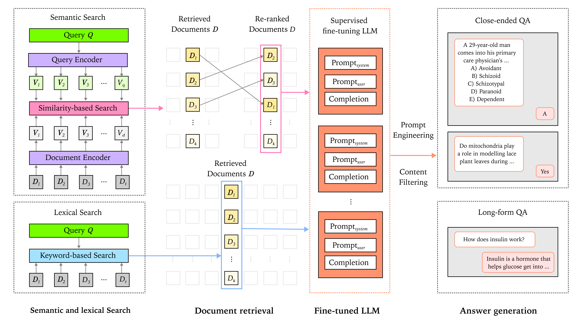
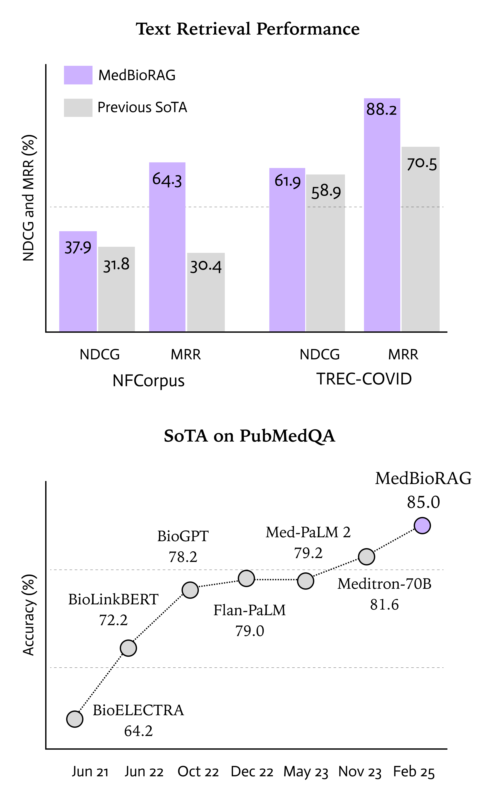

## **📌 MedBioRAG: Semantic Search & Retrieval-Augmented Generation for Biomedical QA**  

  
  

MedBioRAG is a **state-of-the-art system combining Semantic Search, Retrieval-Augmented Generation (RAG), and Fine-tuning** to enhance Large Language Model (LLM) performance in **biomedical question answering (QA).**  

**🔬 Research Paper:** *MedBioRAG: Semantic Search and Retrieval-Augmented Generation with Large Language Models for Medical and Biological QA*  

🚀 **This repository is the official implementation of MedBioRAG, and it is currently under active development.**  

---  

## **🔍 Key Features**  
   -   

1. **Hybrid Search Mechanism**  
   - Utilizes **Semantic Search (context-based retrieval)** + **Lexical Search (keyword-based retrieval)**  
   - Ensures accurate document retrieval for precise answers  
   - 📊 **[Top-K Retrieval Performance](figures/top-k.pdf)** → Performance analysis of retrieval quality  

2. **Retrieval-Augmented Generation (RAG)**  
   - Generates **factual and context-aware answers** using retrieved documents  
   - Fine-tuned GPT-4o enhances response accuracy  

3. **Fine-Tuned Model for Improved Performance**  
   - Trained on MedQA, BioSQA, PubMedQA, and other datasets  
   - **Domain-specific knowledge adaptation** for consistency and factual accuracy  

4. **Support for Multiple QA Tasks**  
   - **Close-ended QA (multiple-choice, selection-based answers)**  
   - **Long-form QA (detailed answer generation)**  

---  

## **🧪 Experimental Results**  

**1️⃣ Document Retrieval Performance**  
- Semantic Search outperforms traditional Lexical Search in **NDCG and MRR scores**  
- **More accurate biomedical literature retrieval**  

**2️⃣ Close-ended QA Performance**  
- Achieves higher accuracy on MedQA, PubMedQA, and BioASQ  

**3️⃣ Long-form QA Performance**  
- MedBioRAG improves **ROUGE and BLEU scores over GPT-4o**  
- Enhances **response coherence and factual accuracy**  

---  

## **📢 Ongoing Work**  

🔄 **We are continuously working on optimizing MedBioRAG’s retrieval and response generation modules.**  
📌 Further improvements and experimental results will be updated soon.  

### **📬 Questions & Feedback**  
For any inquiries or suggestions, please feel free to open an **Issue** or submit a **Pull Request**! 🚀
